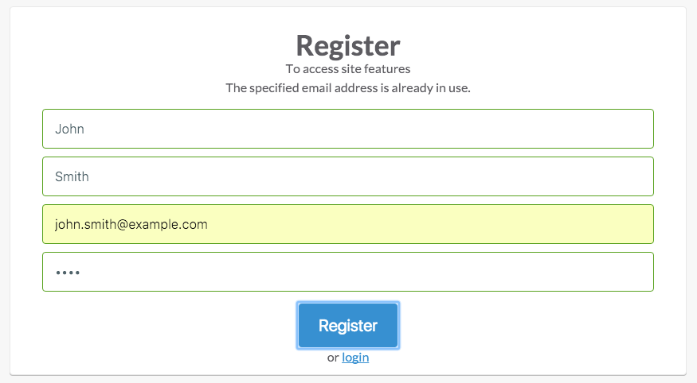
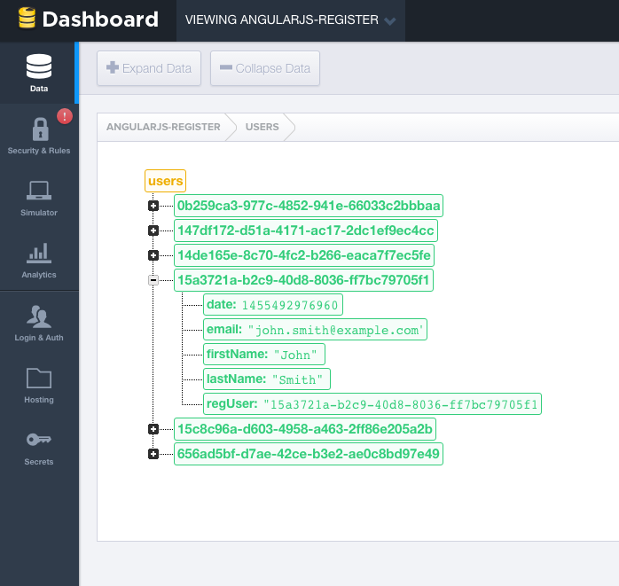

# AngularJS registration

Added registration functionality to an [AngularJS](https://angularjs.org/) app that takes place in [Firebase](https://firebase.com/). Other technologies that are used in this project are as follow:

- [Sass](http://sass-lang.com/)
- [Gulp](http://gulpjs.com/)
- [ngRoute](https://docs.angularjs.org/api/ngRoute)
- [ngAnimate](https://docs.angularjs.org/api/ngAnimate)

